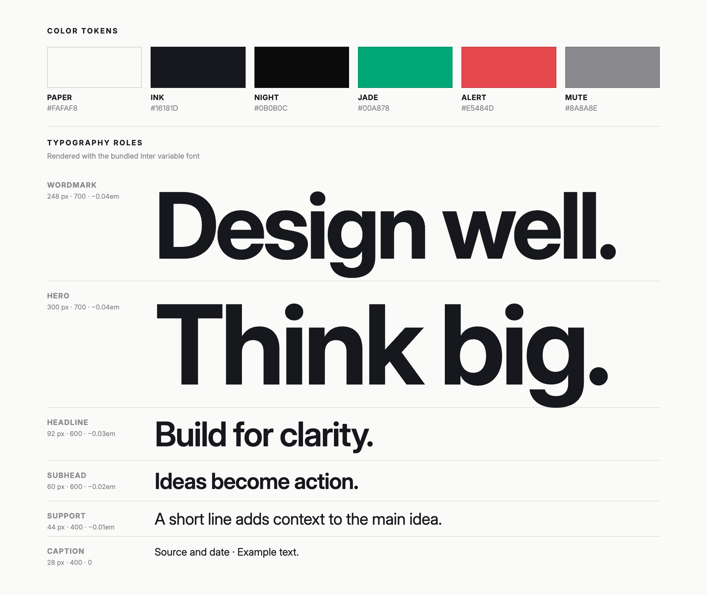

# Presentation Design System

A restrained, type-led visual system for building presentation slides with HTML and CSS. The project contains CSS tokens, reusable layouts and components, written design rules, and a static example gallery.

## Quick start

Link the single public stylesheet from a slide document:

    <link rel="stylesheet" href="css/presentation-system.css">

Create a 16:9 slide canvas and use the provided classes:

    <section class="pds-slide pds-slide--paper pds-layout-headline">
      

        
A section label

        <h1 class="pds-headline">One clear claim for this slide.</h1>
        
A short line that adds context.

      

    </section>

The canvas uses a 1920 × 1080 design reference and scales proportionally to fit its available width. CSS classes and custom properties use the <code>pds-</code> prefix.

## Visual reference

## What's included

- Color, typography, spacing, and surface tokens.
- Shared slide foundation styles, reusable layouts, data components, and media patterns.
- A design-rules reference in <code>docs/design-rules.md</code>.
- A static gallery in <code>examples/gallery.html</code> with previews and links to individual examples.
- Standalone slide examples in <code>examples/slides/</code>.
- Inter variable font, distributed with its SIL Open Font License.

The gallery is a static visual reference built with HTML and CSS.

## Project map

- <code>css/presentation-system.css</code> is the stylesheet to link from a deck.
- <code>css/tokens/</code> contains canonical token values.
- <code>css/base.css</code>, <code>css/layouts.css</code>, <code>css/components.css</code>, and <code>css/media.css</code> contain styles organized by purpose.
- <code>docs/</code> explains the design rules and usage.
- <code>examples/slides/</code> contains one HTML file per example.
- <code>examples/slide-examples.css</code> contains placement rules used only by the example slides.
- <code>examples/gallery.html</code> previews the standalone files in one page.
- <code>assets/</code> contains the Inter font and its license.

## Typography

Inter is bundled for consistent rendering, including offline use. The bundled font is licensed under the SIL Open Font License 1.1; see <code>assets/Inter-OFL.txt</code>.

## Source

This design system is based on and adapts the visual rules from [the original design system repository](https://github.com/v0id-byte/peg-design-system.git).
